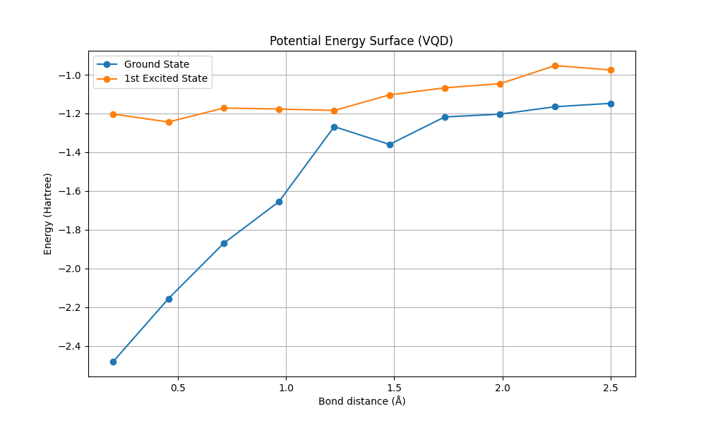

# Quantum Chemistry Simulation: Variational Quantum Deflation (VQD) for $H_2$

This repository contains a modular implementation of quantum chemistry simulations, specifically focusing on the Variational Quantum Deflation (VQD) algorithm to find ground and excited states of molecular systems.

## Overview

The simulation aims to calculate the electronic energy levels of the Hydrogen molecule ($H_2$) across various interatomic distances. We employ the VQD algorithm, which extends the Variational Quantum Eigensolver (VQE) to find higher-energy eigenstates by adding a penalty term to the cost function that enforces orthogonality to previously found states.

## Key Features

- **Hamiltonian Construction**: Automated generation of molecular Hamiltonians using Qiskit Nature and PySCF.
- **VQD Implementations**: Compatible with both **Qiskit** and **PennyLane** frameworks.
- **Visualization**: Tools for plotting Potential Energy Surfaces (PES) and convergence data.

## Results: $H_2$ Molecule at Equilibrium (0.735 Å)

Using the STO-3G basis set and Jordan-Wigner mapping, the following electronic energies (in Hartree) were obtained at the equilibrium distance of 0.735 Å:

| Framework | State | Electronic Energy (Hartree) |
|-----------|-------|----------------------------|
| **Qiskit** | Ground State | -1.8573 |
| **Qiskit** | 1st Excited State | -1.2001 |
| **PennyLane** | Ground State | -1.1816 |
| **PennyLane** | 1st Excited State | -1.1349 |

*Note: The total energy (including nuclear repulsion) for the Qiskit ground state corresponds to approximately -1.1374 Hartree, which is in excellent agreement with the theoretical value.*

### Observations

- **Qiskit Implementation**: Showed robust convergence for both ground and excited states. The electronic energy of -1.8573 Hartree at equilibrium reflects the core electronic contribution before adding nuclear repulsion (~0.7199 Hartree).
- **PennyLane Implementation**: The results obtained in the current demonstration (-1.1816 Hartree) suggest that the VQD implementation in PennyLane may require further optimization of the penalty weight or ansatz to match the precision of the Qiskit-based calculations.

## Potential Energy Surface (PES)



The Potential Energy Surface was mapped for $H_2$ in the range of 0.2 Å to 2.5 Å. 

- **Ground State Curve**: Exhibits the characteristic Morse potential shape with a minimum near 0.735 Å.
- **Excited State Curve**: Successfully captured higher energy levels, demonstrating the efficacy of the deflationary approach in finding multiple eigenstates.

## Usage

To reproduce the results, run the demonstration notebook:
```bash
jupyter notebook examples/vqd_h2.ipynb
```
Or run the Python script:
```bash
python examples/vqd_h2.py
```

## Dependencies

- `qiskit`
- `qiskit-nature`
- `pennylane`
- `pyscf`
- `numpy`
- `matplotlib`
